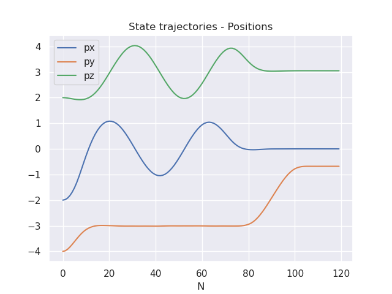
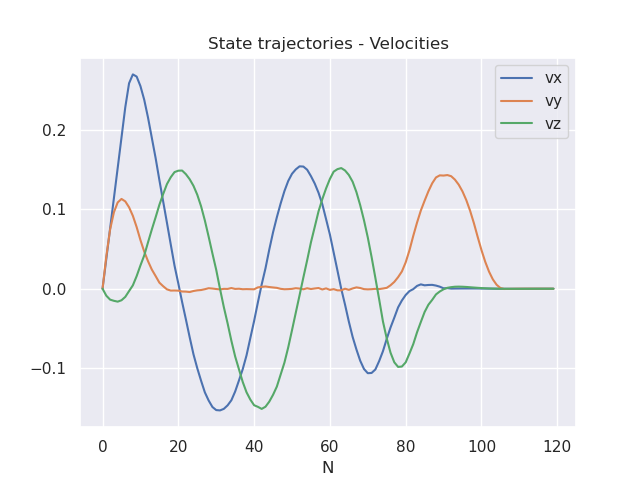
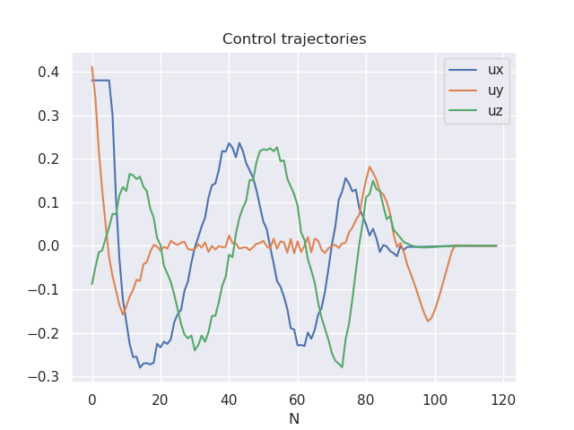

# SpaceX-Dragon-mpc
MPC control for the SpaceX Dragon spacecraft as it rendezvous with the ISS.


<p align="center" width="100%">
    
    <br>The ISS and the SpaceX Dragon spacecraft 
</p>

<br>
The spacecraft is in circular orbit and its objective is to dock to the ISS. The simulation is implemented with a "sim to real gap" to account for unmodeled dynamics.

<br>

The MPC controller solves the following convex optimization problem :

$$
\begin{aligned} 
\min\_{x_{1:N},u_{1:N-1}} \quad & \sum\_{i=1}^{N-1} \bigg[ \frac{1}{2} (x\_i - \tilde{x}\_{ref, i})^TQ({x}\_i - \tilde{x}\_{ref, i}) + \frac{1}{2} u\_i^TRu\_i \bigg] + \frac{1}{2}(x\_N- \tilde{x}\_{ref, N})^TQ\_f
({x}\_N- \tilde{x}\_{ref, N})\\
 \text{st} \quad 
 & x\_1 = x\_{\text{IC}} \\
 & x\_{i+1} = A x\_i + Bu\_i \quad \text{for } i = 1,2,\ldots,N-1  \\
 & u\_{min} \leq u\_i \leq u\_{max} \quad \text{for } i = 1,2,\ldots,N-1 \\
 & x\_i[2] \leq x\_{goal} [2]\quad \text{for } i = 1,2,\ldots,N
 \end{aligned}
 $$


<p align="center" width="100%">
    
    <br>Docking with the MPC controller
</p>


<br>

State and control trajectories:

<br>

<p align="center" width="100%">
      
</p>

<p align="center" width="100%">
      
</p>

<p align="center" width="100%">
      
</p>


<br>

Technologies
------------
The project was created with:
* Python 3.9.0
* numpy 1.24.2
* cvxpy 1.3.1
* matplotlib 3.6.2
* seaborn 0.12.2
* scipy 1.8.1

Installation
------------

To use this project, install it locally via:
```
git clone https://github.com/elena-ecn/SpaceX-Dragon-mpc.git
```

The dependencies can be installed by running:
```
pip install -r requirements.txt
```

To execute the code, run:
```
python3 main.py
```