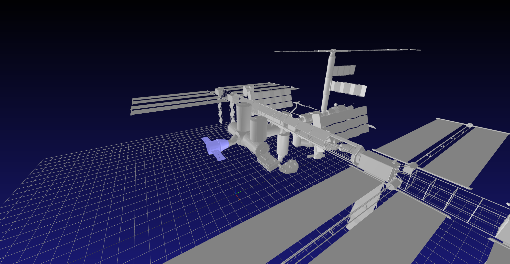

# SpaceX-Dragon-mpc
MPC control for the SpaceX Dragon spacecraft as it rendezvous with the ISS.

    
     The ISS and the SpaceX Dragon spacecraft 

Implemented with a sim to real gap.

The MPC controller solves the following convex optimization problem :

$$ \begin{align*} 
\min_{x_{1:N},u_{1:N-1}} \quad & \sum_{i=1}^{N-1} \bigg[ \frac{1}{2} (x_i - \tilde{x}_{ref, i})^TQ({x}_i - \tilde{x}_{ref, i}) + \frac{1}{2} u_i^TRu_i \bigg] + \frac{1}{2}(x_N- \tilde{x}_{ref, N})^TQ_f
({x}_N- \tilde{x}_{ref, N})\\
 \text{st} \quad & x_1 = x_{\text{IC}} \\
 & x_{i+1} = A x_i + Bu_i \quad \text{for } i = 1,2,\ldots,N-1  \\
 & u_{min} \leq u_i \leq u_{max} \quad \text{for } i = 1,2,\ldots,N-1 \\
 & x_i[2] \leq x_{goal} [2]\quad \text{for } i = 1,2,\ldots,N
 \end{align*}$$

    
     Docking with the MPC controller

